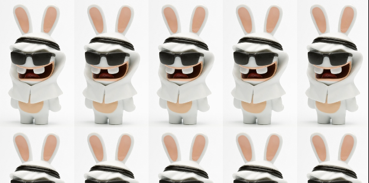
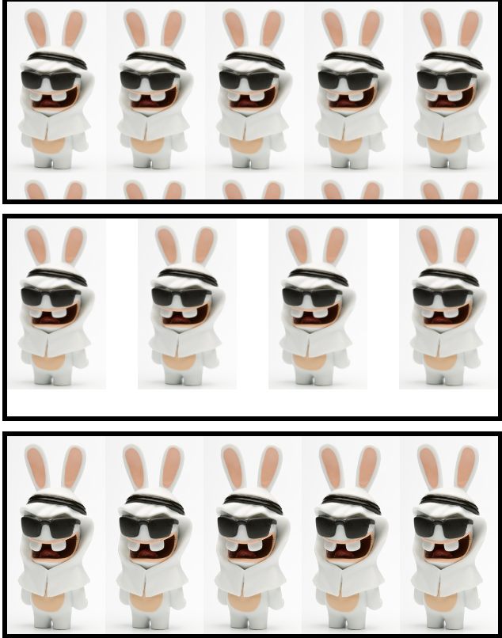

# CSS 배경 꾸미기

### 배경색과 배경 범위 지정
* `background-color` 로 배경색을 지정한다
``` css
  background-color : <16진수값>  |  <rgb, rgba>  |  <색상명> ;
```
* `background-clip` 으로 배경 범위를 지정한다
  * `border-box` : 박스 모델의 테두리까지 적용한다
  * `padding-box` : 박스 모델에서 테두리를 뺀 패딩 범위까지 적용한다
  * `content-box` : 박스 모델에서 내용 부분에만 적용한다
``` css
  background-clip : border-box  |  padding-box  |  content-box ;
```

### 배경 이미지 지정
* `background-image` : 배경 이미지를 지정한다
``` css
body {
  background-image : url(./img/rabbids.jpg);
}
```


<br>

* `background-repeat`: 배경 이미지를 반복 설정한다
  * `repeat` : 화면에 가득 차도록 가로, 세로로 반복한다
  * `repeat-x, repeat-y` : 화면에 가득 차도록 가로(x) 혹은 세로(y)로 반복한다
  * `space` : 이미지가 잘리지 않을 만큼 반복한다(양 끝 고정, 남은 여백에 분배)
  * `round` : 이미지가 잘리지 않도록 사이즈 재조정해서 채운다
  * `no-repeat` : 반복하지 않는다
```css
body {
  background-repeat : repeat(기본) | space | round | no-repeat ;
}
```



<br>

* `background-size` : 배경 이미지의 크기를 조정한다
  * `contain` : 지정한 요소 안에 배경 이미지가 다 들어오도록 이미지를 확대/축소한다
  * `cover` : 지정한 요소를 다 덮도록 배경이미지를 확대/축소한다(너비, 높이 조정)
```css
body {
  background-size : auto(기본값) | contain | cover | <숫자> | <백분율> ;
}
```

* `background-attachment` : 브라우저 스크롤 시 배경을 고정한다
  * `scroll` : 화면 스크롤하면 배경 이미지도 함께 스크롤된다
  * `fixed` : 스크롤해도 배경 이미지는 고정된다
```css
body {
  background-attachment : scroll(기본값)  |  fixed ;
}
```

* `background-position` : 배경 이미지의 위치를 설정ㅎ나다(no-repeat에만 적용)
  * 수평위치 : left  |  center  |  right  |  <백분율>  |  <길이 값> ;
  * 수직위치 : top  |  center  |  bottom  |  <백분율>  |  <길이 값> ;
```css
body {
  background-position : <수평위치>  |  <수직위치>
}
```
* ### [배경 꾸미기 사용예시](./Background.html)

* ### [배경 꾸미기 사용예시(position)](./Background-position.html)