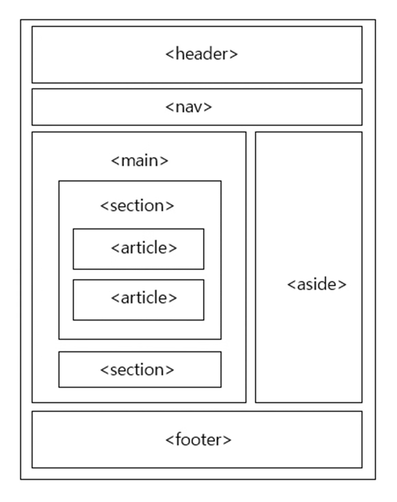

# HTML 기본

### HTML의 구성요소
* #### 태그
  * 웹 페이지를 콘텐츠를 표시하기 위해 사용한다
  * ```<태그의이름> 콘텐츠 </태그의이름>```

* 속성
  * 태그에 부가기능을 추가하기 위해 작성한다
  * 사용해도 되고, 사용하지 않아도 된다 (선택사항)
  * ```<태그의이름 속성명="속성값"> 콘텐츠 </태그의이름>```  

* 주석
  * 웹 페이지에 보이지 않는 코드이다
  * 주로 코드에 설명이나 메모를 추가하기 위해 사용한다
  * ```<!-- 여기에 쓰인 내용은 웹 페이지에서 보이지 않는다 -->```

### Block 과 Inline
* Block 요소
  * 요소 바로 옆에 다른 요소를 넣을 수 없다
  * 전후 줄바꿈이 들어가 다른 요소를 밀어내고 한 줄을 차지한다
  * 대표적인 요소 : p, div, h1
  * ```
    <h1> H1 </h1>
    <div> div </div>
    <p> p </p>
    ```
* Inline 요소
  * Block 요소와 다르게 요소끼리 서로 한 줄에 있을 수 있다
  * 대표적인 요소 : span, a, em
  * ```
    <a> a </a>
    <span> span </span>
    <em> em </em>
    ```

<br>

# 웹 문서의 구조 - 시맨틱 태그
### 시맨틱 태그
* 이름만으로 어떤 역할을 하는지 알 수 있는 태그이다
* HTML 문서만으로 어떤 부분이 제목이고, 메뉴인지 알기 쉽다


### ```<div>``` 
* 소스를 묶는 용도이다
### ```<header>```
* 헤더 영역
* 사이트 전체나 특정 영역의 헤더를 표시한다
### ```<nav>```
* 네비게이션 영역
* 다른 위치로 이동하거나, 다른 웹 문서로 연결하는 링크를 만든다
* id로 구분하여 한 문서 안에 여러 개를 사용 수 있다
### ```<main>```
* 핵심 내용이 들어가는 영역이다
* 웹 문서마다 다른 내용으로 구성한다
* 한 문서에서 한 번만 사용한다
### ```<section>```
* 콘텐츠 영역이나 몇 개의 콘텐츠를 묶는 용도로 사용된다
* CSS 사용을 위해서는 ```<section>```이 아닌 ```<div>```를 사용한다
### ```<article>```
* 독립된 웹 콘텐츠 항목을 나타낸다
* 한 문서에서 여러 개를 사용할 수 있다
### ```<aside>```
* 본문 내용 외에 사이드 바를 표시한다
* 필요할 때만 선택해서 사용한다
### ```<footer>```
* 웹 문서에서 맨 아래 쪽에 위치한다

* ### [기본태그 사용예시](./BasicEx.html)
