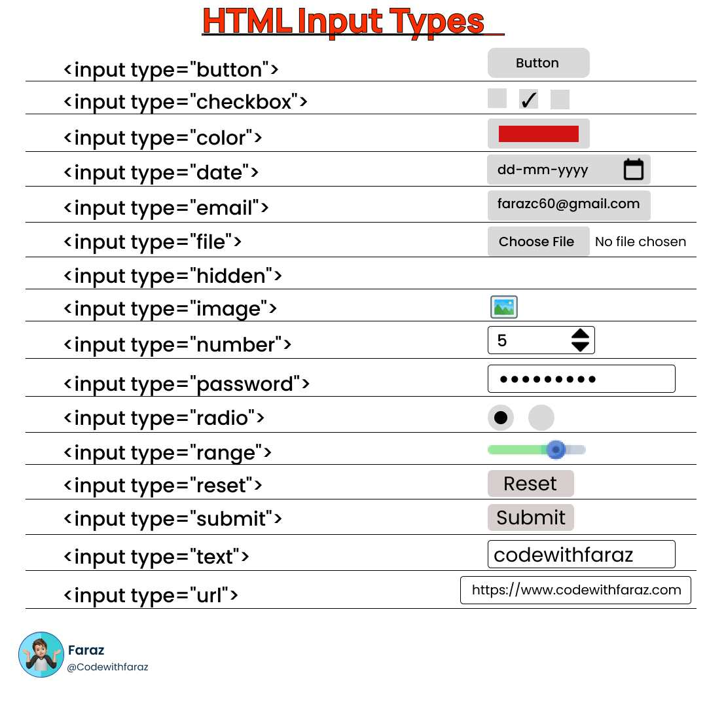

# body 주요 태그 - 폼 만들기
### 폼(form)이란 ?
* 사용자 의견이나 정보를 알기 위해 입력할 큰 틀을 만드는데 사용된다
* 입력된 데이터를 한 번에 서버로 전송한다
* 전송한 데이터는 웹 서버가 처리하고, 결과에 따른 또 다른 웹페이지를 보여준다

## ```<form>``` <br>
* 사용자 입력을 받거나 서버로 데이터를 보낼 때 사용, input 태그와 함꼐 사용한다

<table>
<tbody>
  <tr>
    <th>종류</th>
    <th>설명</th>
  </tr>
  <tr>
    <td>action</td>
    <td>form 태그 속 내용을 처리해줄 서버 상의 스크립트 주소</td>
  </tr>
  <tr>
    <td>method</td>
    <td>입력 내용을 서버에 어떻게 넘겨줄 지 지정 <br>
        - POST : 데이터를 별도로 첨부해 전달하여 외부에 드러나지 않고, 크기 제한이 없다 <br>
        - GET : 주소에 데이터를 전달, 주소 입력창에 데이터가 그대로 드러나며 데이터 크기가 제한적이다 ( ex. 쿼리 )
    </td>
  </tr>
    <tr>
    <td>name</td>
    <td>JS로 폼을 제어할 때 사용할 폼의 이름 지정</td>
  </tr>
  <tr>
    <td>target</td>
    <td>action 속성에서 지정한 스크립트 파일로 이동하는 방법 지정 (_self, _blank)</td>
  </tr>
  <tr>
    <td>autocomplete</td>
    <td>내용을 입력할 때 자동 완성 기능이며, 기본 속성 값은 “on”</td>
  </tr>
</tbody>
</table>

## ```<fieldset>```
* 하나의 폼 안에서 여러 구역을 나누어 표시할 때 사용한다

## ```<legend>```
* \<fieldset> 태그로 묶은 그룹에 제목을 붙이는 태그이다

## ```<label>```
* 폼 요소에 이름을 붙일 때 사용
* for 이나 class 속성을 사용하면 레이블과 \<input> 태그가 떨어져 있어도 둘을 쉽게 연결할 수 있다

## ```<input>```
* 사용자로부터 데이터를 입력받는 태그이다


  
## ```<input>``` 태그 이외에 여러가지 태그
<table>
  <tbody>
    <tr>
      <th>종류</th>
      <th>설명</th>
      <th>관련 속성</th>
    </tr>
    <tr>
      <td> &lt;textarea> </td>
      <td> 텍스트를 여러 줄 입력하는 영역 </td>
      <td> cols : 가로 너비 지정 / rows : 세로 길이 지정 (줄 단위) </td>
    </tr>
    <tr>
      <td> &lt;select> </td>
      <td> 드롭다운 목록 표시 </td>
      <td> size : 화면에 표시할 드롭다운 항목 개수 <br>
           multiple : 드롭다운 목록에서 둘 이상의 항목 선택 시 사용 </td>
    </tr>
    <tr>
      <td> &lt;datalist> </td>
      <td> 데이터를 입력할 때 자동완성 기능 제공 </td>
      <td> value : 서버로 넘겨줄 값, 텍스트 필드에 나타남 <br>
           list : 데이터 목록 연결 </td>
    </tr>
    <tr>
      <td> &lt;option> </td>
      <td> 드롭다운, 데이터 목록 항목 표시 </td>
      <td> value : 항목을 선택할 때 서버로 넘겨줄 값 지정 <br>
           selected : 드롭다운 메뉴에서 기본으로 보여 줄 항목 지정 </td>
    </tr>
    <tr>
      <td> &lt;button> </td>
      <td> 버튼 태그로 버튼 삽입 </td>
      <td> sumit : 서버 전송 / reset : 초기화 / button : 기능X</td>
    </tr>
  </tbody>
</table>

* ### [폼 사용예시 1](./FormEx1.html)
* ### [폼 사용예시 2](./FormEx2.Html)